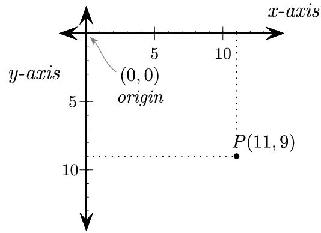

title: Warsztaty CODE {sun} DAY - Python 15.12.2019
class: animation-fade
layout: true

---

class: impact

# {{title}}

---

# Mateusz Bełczowski


[https://twitter.com/mateusz__be](@mateusz__be)

[https://www.linkedin.com/in/mateusz-be%C5%82czowski-720922124/](Linkedin)


---

# Program warsztatów

- Sprawdzenie konfiguracji

- Dyskusja nad mechanizmami gry Snake

- Powtórzenie podstawowych zagadnień z Pythona

- Wprowadzenie do biblioteki Pygame

- Stworzenie gry Snake


---

# Sprawdzenie konfiguracji


- zainstalowany Python 3.6+ (Python 3.6, Python 3.7 lub Python 3.8)
- zainstalowany Pycharm
- podpięcie zainstalowanej wersji Pythona jako interpreter w Pycharmie
- zainstalowanie biblioteki Pygame

---


# Mechanizmy gry Snake

--

- narysowanie planszy

- narysowanie segmentów, z których składa się wąż

- reagowanie na przyciski wciśnięte przez użytkownika

- przesuwanie węża w odpowiednią stronę

- przechodzenie przez ściany / zderzenie ze ścianą

- narysowanie jedzenia

- obliczanie wyniku

- warunek zjedzenie 

- warunek końca gry

---

# Python

- język programowania

- standardowe rozszerzeniu pliku to ".py"

- wcięcia w kodzie pełnią istotną rolę

- bogaty ekosystem - dużo istniejących rozwiązań, które możemy wykorzystać u siebie w aplikacji

- wszechstronność zastosowań


---

# Sposoby wykonywania kodu Pythonowego

- tryb interaktywny

```
python

>>> print("Hello World!")
"Hello World!"
```

- uruchomienie skryptu

```
~ python hello_world.py
```

---

# Zmienne

- Przypisywanie do zmiennych

```
ocena = 6
ulubiona_ksiazka = "Władca Pierścieni"
```

- Wielokrotne przypisania

```
ulubiony_film = ulubiona_ksiazka = "Władca Pierścieni"
```

```
wiek, wzrost = 10, 140
```

```
imie, nazwisko, rok_urodzenia = "Jan", "Kowalski", 1999
```

---


# Typy danych

---

# Liczby całkowite

```
a = 3
```

```
b = 14
```

```
a < b
```

```
b / a
```

---

# Liczby zmiennoprzecinkowe

```
a = 6.0
```

```
b = 14.0
```

```
c = 6.34
```

```
b / a
```

---

# Operacje arytmetyczne

`+`

`-`

`*`

`/`

`%`

`**`

`//`

`abs()`

---

# Porównania

`<`

`>`

`<=`

`>=`

`==`

`!=`

---

# Zmienne logiczne

`True`

`False`

--

Truthy

Falsy

--

```
a = 'slon'
b = ''
bool(a)
bool(b)
```

```
x and y
x or y
not x
```
---


---

# Napisy

" "

' '

---

# Napisy

format()

input()

len()

print()

zakresy:

```
greeting = "Hello, World"
salutation = greeting[:5]
name = greeting[7:]
comma = greeting[5:6]
```

---

# Formatowanie tekstu

```
"Hello, {}".format(name)
```

Python 3.6+:

```
f"Hello, {name}"
```

```
f'Wynik dodawania to {4 + 3}'
```

Więcej: https://realpython.com/python-string-formatting/

---

# Operacje na napisach

`x in y`

count()

find()

index()

join()

split()

replace()

---

# Pobieranie i konwertowanie danych od użytkownika

- `input()`

- `input(prompt='jak jest?')`

- `input('jak jest?')`

- `input()` zwraca napis

---

# Zadanie 0


Napisz program, który zapyta użytkownika o imię, a następnie wyświetli napis z pobranym imieniem oraz liczbą liter, z którego się ono składa, np. "Twoje imię to Mateusz i składa się z 7 znaków"

---


# Instrukcje warunkowe

- wcięcia determinują blok kodu

- `if`

--

- `if` + `else`

--

- `if` + `elif` + `else`

- proste i złożone operacje logiczne

---
# Zadanie 1

Napisz program, który umożliwi wprowadzenie imienia użytkownika, a następnie oceni, czy jest ono długie czy nie. Uznajmy, że imiona dłuższe niż 8 znaków (czyli od 9 w górę) są długie, zaś pozostałe traktujemy jako krótkie. Program powinien wyświetlić użytkownikowi informację (napis) z decyzją.

---


# Zadanie 2

Napisz program, który pobiera wiek oraz wzrost użytkownika i sprawdza, czy może on wejść na zjeżdżalnię w parku rozrywki. Jako limit zakładamy min. 10 lat ORAZ min. 140 cm wzrostu.

---

# Zadanie 3

Napisz program, który pobiera od użytkownika wynik z testu w procentach i wyświetla odpowiadającą temu wynikowi ocenę
Przykładowa skala ocen:

- 91 % – 100 % -> 5
- 75 % – 90 %  -> 4
- 51 % – 74 %  -> 3
- 30 % – 50 %  -> 2
- 0 % – 29 %   -> 1

---

# Instrukcje sterujące (for)

- `for element in iterator`
  
  - wykonywana po kolei dla każdego elementu
  
  - możliwość iterowania po wszystkim, co jest uważane za `iterable` (np. napis, lista itp.)

  - funkcja `range` zwraca kolejne liczby (domknięte lewostronnie)

  - `break`

  - `continue`

---


# Instrukcje sterujące (while)

- `while predykat`

  - wykonywana tak dlugo jak długo predykat w wyrażeniu jest prawdą
  
  - może być nieskończona
  
  - wyjście z pętli

---

# Zadanie 4

Napisz program, który wypisze 100 razy wybrany przez Ciebie napis

---

# Zadanie 5

Napisz program, który wypisuje liczby mniejsze od 100 które sa parzyste i
podzielne przez 3.

---

# Zadanie 6

Napisz program, który wylosuje liczbę z zakresu 1-100, a następnie do zadania użytkownika będzie należało jej odgadnięcie:
- program informuje, że podana liczba jest za duża lub za mała
- program kończy się, gdy użytkownik zgadnie właściwą liczbę
- program powinien w tym momencie pogratulować mu wygranej oraz poinformować o liczbie prób, które były potrzebne

Podpowiedź jak wygenerować losową liczbę:

`import random`

`wylosowana_liczba = random.randint(1, 101) # wygeneruj liczbę z zakresu 1-100`


---

# Listy

- tworzenie list
- łączenie dwóch list
- puste listy
- pobieranie elementu listy
- modyfikowanie elementu listy
- iterowanie po elementach listy
- dodawanie elementu na koniec listy
- zdejmowanie elementu z końca listy
- sortowanie list
- listy zagnieżdżone

---

# Zadanie 7

Napisz program, który:
- pobierze od użytkownika 5 dowolnych wyrazów i utworzy z nich listę
- posortuje utworzoną listę
- wyświetli pierwszy element listy
- zapyta użytkownika o kolejny wyraz, który ma nadpisać wyświetlony element
- wyświetli elementy listy w celu potwierdzenia, że dokonano modyfikacji

```
Podaj wyraz ->kot
Podaj wyraz ->pies
Podaj wyraz ->leniwiec
Podaj wyraz ->pingwin
Podaj wyraz ->lemur
Pierwszy element na liscie to: kot
Jakim wyrazem chcesz zastąpić ten element ->tygrys
['tygrys', 'lemur', 'leniwiec', 'pies', 'pingwin']
```

---


# Funkcje

```
def funkcja():
  pass
```

- grupuje szereg instrukcji
- ułatwia powtarzalność
- może schować złożone zagadnienia
- funkcje bez argumentów
- funkcje z argumentami
- funkcje z argumentami domyślnymi

---

# Podstawy Pygame

- pętla zdarzeń


---

# Podstawy Pygame

- wyświetlenie planszy
- narysowanie prostokąta
- pobranie klawisza
- zakończenie gry
- wyświetlenie napisu
- sterowanie czasem

---

# Współrzędne w Pygame




---
# Napiszmy własną grę!

1. Stwórzmy kod, który wyświetla planszę
2. Umieśćmy nieruchomego węża na planszy (np. wąż startuje z 3 członami / segmentami)
3. Poruszanie się węża w zadanym kierunku
4. Generowanie jedzenia na planszy
5. Umożliwienie zjadania jedzenia przez węża
6. Obsługa przechodzenia przez ściany / zderzenia ze ścianą
7. Wykrycie zderzenia się węża z samym sobą i zakończenie gry
8. Wyświetlanie wyniku

---
